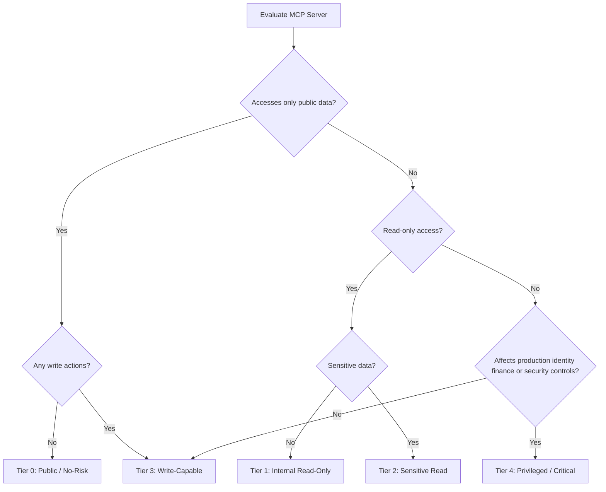

# Chapter 5: MCP Server Classification Model

**Audience:** Security architects, AppSec, data owners, and approval authorities  
**Decision supported:** Assigning the correct risk tier to determine approval authority and required controls  
**Reading time:** ~22 minutes

---

## Why Classification Is the Most Important Decision

Of every decision in MCP governance, classification has the widest downstream impact. The tier you assign determines:

- **Who must approve** the server (team lead vs. CISO)
- **What controls are mandatory** (basic logging vs. PAM + threat model)
- **How often it must be reviewed** (annually vs. monthly)
- **Whether the server can operate in production** at all

Get classification wrong and you either block legitimate productivity (over-classification without justification) or expose the organization to unmanaged risk (under-classification).

**The golden rule:** Classify based on the **highest-risk tool** the server exposes — not the server name, not the average risk across tools, and not the requester's assurances.

Evaluate each MCP server across these dimensions:

- Data access sensitivity
- Action capability (read vs. write vs. admin)
- Identity scope
- Deployment location and exposure
- Vendor/source trust
- Business criticality
- Blast radius

---

## Tier Decision Tree

Use this tree during classification. When in doubt, classify higher and document rationale — downgrading requires formal review.

### How to walk the tree

1. **Start with data:** What is the most sensitive data any tool can access?
2. **Then actions:** What is the most dangerous action any tool can perform?
3. **Then blast radius:** If abused, who or what is affected?
4. **Assign the highest applicable tier** — the tree outcome is your floor, not your ceiling.

---

## Tier 0: Public / No-Risk MCP

### Description

Accesses only **public information** and performs **no write actions**. These servers add context from the open internet or public APIs without touching internal data.

| Attribute | Detail |
|-----------|--------|
| Risk level | Low |
| Approval authority | Lightweight review (team lead or AppSec delegate) |
| Review cadence | Annually |
| Typical score range | 8–12 ([Chapter 6](06-risk-scoring.md)) |

### Examples

- Public documentation search (vendor docs, MDN, official API references)
- Public weather or geolocation data
- Public package metadata lookup (npm, PyPI registry metadata — not private registries)
- Public GitHub repository search (no auth to private repos)

### Controls required

- Basic inventory ([Chapter 4](04-asset-inventory.md))
- Version tracking
- No secrets stored or transmitted in configuration
- No sensitive data access — verify during review
- No write tools enabled

### Common mistakes

- **Treating internal docs as Tier 0** — if it requires authentication to read, it is not public
- **Ignoring a dormant write tool** — a server with one public read tool and one write tool is Tier 3, not Tier 0
- **Skipping inventory** — Tier 0 still gets inventoried; low risk is not no risk

---

## Tier 1: Internal Read-Only MCP

### Description

Reads **internal but non-sensitive** business data. No write, delete, or execute actions.

| Attribute | Detail |
|-----------|--------|
| Risk level | Low to Medium |
| Approval authority | Security + business owner |
| Review cadence | Annually |
| Typical score range | 12–18 |

### Examples

- Internal wiki search (engineering docs, non-confidential runbooks)
- Engineering documentation search (Confluence spaces without HR/legal content)
- Read-only project tracker (Jira/Linear read without security or HR projects)
- Internal package registry metadata (read-only)

### Controls required

- SSO authentication
- User-level access control (agent uses user's identity, not shared service account)
- Basic audit logging (server, tool, timestamp, outcome)
- Data classification check — confirm data is non-sensitive
- No broad export by default (limit result set sizes)
- OAuth 2.1 with audience validation ([MCP Authorization Specification](https://spec.modelcontextprotocol.io/specification/2025-03-26/basic/authorization/))

### When Tier 1 becomes Tier 2

Upgrade to Tier 2 if the server can read:

- Customer PII or CRM data
- Security tickets, vulnerability reports, or incident data
- HR, legal, or financial documents
- Source code classified as confidential
- Any regulated data (HIPAA, PCI, GDPR-special-category)

---

## Tier 2: Sensitive Read MCP

### Description

Reads **sensitive** business, customer, employee, or security data. Still read-only — no write actions. This is where data protection and privacy review enter the picture.

| Attribute | Detail |
|-----------|--------|
| Risk level | Medium to High |
| Approval authority | Security + data owner + privacy/legal if required |
| Review cadence | Every 6 months |
| Typical score range | 18–26 |

### Examples

- Google Drive / SharePoint MCP accessing confidential folders
- Jira MCP with access to security or compliance tickets
- CRM MCP (Salesforce, HubSpot) with customer data
- HR knowledge base MCP
- Vulnerability management MCP (Qualys, Snyk with finding details)
- Internal source code MCP (private repositories)

### Controls required

- Strong authentication (SSO + MFA)
- Scoped authorization — minimum OAuth scopes
- DLP controls on tool inputs and outputs
- Full audit logs with user/agent/tool/action attribution
- Data minimization — return only fields needed for use case
- Prompt injection testing ([OWASP MCP04](https://owasp.org/www-project-mcp-top-10/))
- Vendor review if third-party ([Chapter 9](09-third-party-review.md))
- Periodic access review (quarterly user/group access check)
- Legal/privacy consultation if regulated data involved

### Approval note

Tier 2 is often where organizations first feel governance friction. That friction is appropriate. Sensitive read access through an autonomous agent is a meaningful risk — document the business need clearly and ensure DLP and logging are in place before approval.

---

## Tier 3: Write-Capable MCP

### Description

Can **create, modify, delete, send, deploy, merge, approve, or trigger workflows**. Any write capability places a server at Tier 3 minimum — regardless of data sensitivity.

| Attribute | Detail |
|-----------|--------|
| Risk level | High |
| Approval authority | Security architecture + business owner + platform owner |
| Review cadence | Quarterly |
| Typical score range | 22–32 |

### Examples

- GitHub PR creation and merge MCP
- Slack or Teams posting MCP
- Email sending MCP
- Jira ticket create/update MCP
- CI/CD pipeline trigger MCP
- Cloud resource creation MCP (non-admin scope)
- Database write MCP (insert/update records)

### Controls required

- Explicit human approval (HITL) for sensitive write actions ([Chapter 3 — Principle 4](03-governance-principles.md))
- Transaction logging with full attribution
- Rate limits on write operations
- Rollback plan documented and tested
- Strong tool-level authorization
- Separate read and write scopes (prefer separate servers)
- Abuse case testing (prompt injection, runaway agent scenarios)
- Runtime monitoring and alerting ([Chapter 13](13-continuous-monitoring.md))
- Threat model recommended; required if score ≥ 28

### Common failure modes

- Agent merges unreviewed code to production branch
- Prompt injection via ticket/email content triggers unauthorized post or send
- Runaway agent creates hundreds of tickets or messages
- Write MCP combined with read MCP in same agent session enables tool chaining exfiltration

**Guide reference:** [Chapter 11 — High-Risk Use Cases](11-high-risk-use-cases.md)

---

## Tier 4: Privileged / Critical MCP

### Description

Can affect **production systems, identity, finance, customer data at scale, security controls, or infrastructure**. Tier 4 is the highest classification — each server requires CISO or delegated risk board approval.

| Attribute | Detail |
|-----------|--------|
| Risk level | Critical |
| Approval authority | CISO or delegated security risk board |
| Review cadence | Monthly or continuous review |
| Typical score range | 30–40 |

### Examples

- AWS / GCP / Azure admin MCP
- Kubernetes cluster-admin MCP
- IAM / identity provider admin MCP
- Secrets manager MCP (Vault, AWS Secrets Manager)
- SIEM / SOAR action MCP (create cases, block IPs, isolate endpoints)
- Payment / finance workflow MCP
- Production deployment MCP with direct release authority
- GitHub org admin MCP (branch protection, secret management)

### Controls required

- Formal threat model (STRIDE or equivalent applied to MCP tool chain)
- Formal risk acceptance signed by CISO
- Privileged access management (PAM) integration
- Break-glass process documented ([Chapter 14](14-incident-response.md))
- Segregation of duties — agent cannot both initiate and approve privileged actions
- Just-in-time (JIT) access — no standing privileged credentials
- Full audit trail with SIEM integration
- Mandatory real-time monitoring and alerting
- Incident response playbook specific to this server
- Production change-control alignment
- CISO approval gate enforced

### Approval note

Before approving Tier 4, ask: **Can this use case be served at Tier 3 with narrower scope?** Most Tier 4 requests can be decomposed into lower-tier servers with predefined action templates. Tier 4 should be rare, justified, and time-bound.

---

## Classification Rules

These five rules prevent the most common classification errors.

### Rule 1: Classify by highest-risk tool

If a server has one read tool and one admin tool, it is **Tier 4**. Do not average. Do not label it Tier 1 because "mostly read."

### Rule 2: Re-classify when tools change

Adding a write tool to a Tier 1 server triggers immediate re-classification. [OWASP MCP05: Tool Permission Smuggling](https://owasp.org/www-project-mcp-top-10/) describes the risk of hidden or undocumented tool additions.

### Rule 3: Do not downgrade without review

Removing tools does not automatically lower the tier. Confirm the tool is disabled in production, verify via testing, document the downgrade rationale, and obtain approver sign-off.

### Rule 4: Separate servers by tier when possible

Prefer:

- Read-only GitHub MCP (Tier 1) **and** separate PR-merge MCP (Tier 3)

Over:

- Single GitHub MCP with read + merge + admin tools (Tier 4)

Separation simplifies approval, monitoring, and revocation.

### Rule 5: Document the rationale

Every tier assignment must include written rationale in the [Approval Decision Form](../templates/approval-decision-form.md): which tool drove the tier, what data is accessed, and what alternatives were considered.

---

## Worked Classification Examples

### Example A: "Slack MCP"

| Configuration | Tier | Rationale |
|---------------|------|-----------|
| Search public channels (read) | 1 | Internal non-sensitive read |
| Read DMs and private channels | 2 | Sensitive communications |
| Post to `#general` or external contacts | 3 | Write capability |
| Admin: manage apps, tokens, workspace settings | 4 | Privileged access |

### Example B: "Filesystem MCP"

| Configuration | Tier | Rationale |
|---------------|------|-----------|
| Read files in project directory only | 1–2 | Depends on data sensitivity |
| Read/write anywhere in home directory | 3 | Write capability |
| Execute shell commands | 4 | Privileged execution |

### Example C: "Database MCP"

| Configuration | Tier | Rationale |
|---------------|------|-----------|
| Read-only queries on analytics replica | 1–2 | Depends on data classification |
| Read production customer database | 2 | Sensitive read |
| Insert/update records | 3 | Write capability |
| DDL, grant permissions, drop tables | 4 | Privileged/admin |

---

## Tier Summary Table

| Tier | Data | Actions | Approval | CISO required | Review |
|------|------|---------|----------|---------------|--------|
| 0 | Public only | None (read public) | Lightweight | No | Annually |
| 1 | Internal non-sensitive | Read-only | Security + business owner | No | Annually |
| 2 | Sensitive / regulated | Read-only | Security + data owner (+ legal) | Sometimes | Every 6 months |
| 3 | Any | Write / delete / deploy | Security arch + business + platform | Sometimes | Quarterly |
| 4 | Production / identity / finance | Admin / privileged | CISO / risk board | **Required** | Monthly |

---

## References

| Source | Relevance |
|--------|-----------|
| [Chapter 3 — Principle 2: Classify Before You Connect](03-governance-principles.md) | Foundational principle |
| [Chapter 6 — Risk Scoring](06-risk-scoring.md) | Quantitative complement to tiers |
| [Chapter 10 — Minimum Security Baseline](10-minimum-security-baseline.md) | Controls per tier |
| [OWASP MCP02: Privilege Escalation](https://owasp.org/www-project-mcp-top-10/) | Least privilege and tier alignment |

---

## Practitioner Checklist

- [ ] Every inventoried MCP server has an assigned tier
- [ ] Classification based on highest-risk tool, not server name
- [ ] Tier rationale documented in approval record
- [ ] Re-classification process defined for tool additions/changes
- [ ] Approval authority mapped to each tier
- [ ] Review cadence scheduled per tier
- [ ] Tier 3–4 servers have enhanced controls per [Chapter 10](10-minimum-security-baseline.md)
- [ ] Worked examples shared with engineering teams to set expectations

---

**Next:** [Chapter 6 — MCP Risk Scoring Model](06-risk-scoring.md) provides a quantitative method to complement tier classification and support borderline decisions.
