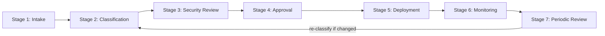

# Chapter 7: Approval Workflow

**Audience:** Security architects, AppSec, business owners, and approval authorities  
**Decision supported:** Whether to approve, conditionally approve, or reject an MCP server  
**Reading time:** ~25 minutes

---

## The Operational Core of MCP Governance

Policies and principles mean nothing without a workflow that produces documented decisions. The approval workflow is where intake data, classification, risk scores, security review, and ownership assignments become a formal outcome: **approve**, **conditionally approve**, **reject**, or **exception with risk acceptance**.

Every MCP server must pass through this workflow before production use. No informal "just try it in dev" paths that silently reach production.

This chapter defines all seven stages of the governance lifecycle — from first request through ongoing periodic review.

---

## Governance Lifecycle Overview

| Stage | Purpose | Primary owner | Output |
|-------|---------|---------------|--------|
| 1 — Intake | Capture request | Requester / business owner | Completed [Intake Form](../templates/intake-form.md) |
| 2 — Classification | Assign tier and score | AppSec | Tier, risk score, rationale |
| 3 — Security Review | Technical assessment | AppSec + Engineering | Review findings, control gaps |
| 4 — Approval | Formal decision | Tier-based approver | [Approval Decision Form](../templates/approval-decision-form.md) |
| 5 — Deployment | Controlled rollout | Engineering | Server live with controls enforced |
| 6 — Monitoring | Ongoing visibility | AppSec + SecOps | Logs, alerts, metrics |
| 7 — Periodic Review | Sustained compliance | AppSec + owner | Updated risk register entry |

---

## Stage 1: Intake

### Purpose

Capture everything needed to evaluate the MCP server — before any connection to enterprise AI systems.

### Who does what

| Role | Action |
|------|--------|
| Requester (engineering or business) | Completes [Intake Form](../templates/intake-form.md) |
| Business owner | Validates use case and accepts ownership |
| AppSec | Acknowledges receipt; validates completeness |

### Required fields

- MCP server name and use case
- Owner and requesting team
- Data accessed and tools/actions exposed
- Deployment location and source/vendor
- Authentication model and expected users

### Gate: No owner, no review

Incomplete intake forms are **returned to the requester**. Review does not begin without a named owner ([Chapter 3 — Principle 1](03-governance-principles.md)).

### Recommended SLAs

| Tier | Target time intake → decision |
|------|------------------------------|
| 0–1 | 5 business days |
| 2 | 10 business days |
| 3 | 15 business days |
| 4 | 20 business days |

Predictable SLAs reduce shadow MCP incentive ([Chapter 4](04-asset-inventory.md)).

---

## Stage 2: Classification

### Purpose

Assign risk tier and initial risk score so the right reviewers and controls apply.

### Activities

1. Assign Tier 0–4 per [Chapter 5](05-server-classification.md) — **highest-risk tool** drives tier
2. Complete risk scoring worksheet per [Chapter 6](06-risk-scoring.md)
3. Determine data classification (public, internal, confidential, regulated)
4. Assess business criticality and blast radius
5. Identify if third-party review is required ([Chapter 9](09-third-party-review.md))
6. Map approval authority for this tier

### Output

- Tier assignment with written rationale
- Risk score with factor notes
- List of required controls from [Chapter 10](10-minimum-security-baseline.md)
- Identified gaps (if any) for conditional approval path

### Gate

Classification must be documented before security review begins. Discrepancies between tier and score must be resolved or explicitly noted.

---

## Stage 3: Security Review

### Purpose

Conduct technical assessment based on tier. Verify the server can meet minimum controls.

### Review areas

| Area | What to evaluate | Tier 0–1 | Tier 2+ | Tier 3–4 |
|------|------------------|----------|---------|----------|
| AuthN / AuthZ | SSO, OAuth 2.1, scoped tokens, audience validation | Basic | Full | Full + MFA/PAM |
| Secrets handling | No hardcoded credentials; vault/KMS | Check | Required | Required |
| Token handling | No token passthrough; audience validation | N/A–Check | Required | Required |
| Tool permissions | Least privilege per tool | Check | Required | Required + separation |
| Prompt injection | Exposure to untrusted content | Optional | Test | Test + HITL |
| Command execution | Shell access restricted/prohibited | Check | Required | Prohibited or sandboxed |
| Logging | Audit trail with attribution | Basic | Full | Full + SIEM |
| Network access | Egress restrictions | Optional | Recommended | Required |
| Dependencies | SBOM, CVE status, maintenance | Optional | Required if external | Required |
| Vendor posture | Third-party review | If external | Required if external | Required |
| Threat model | STRIDE or equivalent | Optional | Recommended | **Required** |

### Review process

1. **Document review** — intake, architecture diagram, tool list, auth flow
2. **Hands-on testing** — deploy in isolated environment; test auth, logging, HITL, scope enforcement
3. **Token testing** — attempt token passthrough with wrong audience; verify rejection ([MCP Authorization Specification](https://spec.modelcontextprotocol.io/specification/2025-03-26/basic/authorization/))
4. **Findings report** — pass, pass with conditions, or fail per area
5. **Gap list** — controls missing vs. [Chapter 10](10-minimum-security-baseline.md) baseline

### Gate

- **Tier 2+:** Formal security review required
- **Tier 3–4:** Threat modeling required
- **Tier 4:** CISO engagement before approval decision

---

## Stage 4: Approval Decision

### Purpose

Transform review findings into a documented decision with assigned controls, conditions, and ownership.

Three standard outcomes plus exception path:

---

### Outcome 1: Approve

**Approve when all of the following are true:**

| Criterion | Verification |
|-----------|--------------|
| Business use case clear and documented | Intake form + owner confirmation |
| Owner defined and accountable | Named person in intake |
| Data access scoped and appropriate | Classification documented |
| Tool actions limited to business need | Tool list reviewed; excess tools disabled |
| Authentication strong | SSO/OAuth for Tier 1+; MFA for Tier 3–4 |
| Logs available and meet audit requirements | Test tool call produces log entry |
| Vendor/source trusted | Review completed if external |
| Risks tested and documented | Security review findings addressed |

**Actions:**

1. Record decision in [Approval Decision Form](../templates/approval-decision-form.md)
2. Add to [Risk Register](../templates/risk-register.md) with status "approved"
3. Communicate required controls to engineering
4. Proceed to Stage 5 deployment
5. Schedule first periodic review date

---

### Outcome 2: Conditionally Approve

**Use when** the server has clear business value but controls are incomplete.

**Common conditions:**

| Condition | Example deadline |
|-----------|------------------|
| Access must be reduced | Remove merge tool within 14 days |
| Logging must be improved | MCP-level SIEM integration within 30 days |
| Vendor needs additional review | Complete questionnaire within 10 days |
| HITL must be added for write actions | Before production rollout |
| Deployment limited to pilot users | 5 users for 60 days, then re-evaluate |
| Threat model must be completed | Within 15 business days |

**Actions:**

1. Record conditions, owners, and deadlines in Approval Decision Form
2. Add to Risk Register with status "conditional"
3. Deploy **only** with conditions enforced (pilot group, reduced scope, etc.)
4. Track remediation — escalate if deadlines missed
5. Full approval only after conditions met and verified

**Rule:** Conditional is not indefinite. Every condition has an owner and a deadline.

---

### Outcome 3: Reject

**Reject when any of the following are true:**

| Rejection trigger | Example |
|-------------------|---------|
| No clear business owner | Owner field blank or generic team alias |
| Unknown or unverified source | Random GitHub repo, no maintainer |
| Excessive permissions that cannot be scoped | Admin IAM with no justification |
| No logging capability | Server cannot produce audit trail |
| No authentication (Tier 1+) | Open endpoint on internal network |
| Hardcoded secrets discovered | API key in config file |
| Unsafe command execution | Unsandboxed shell on production host |
| Broad filesystem access | Read/write entire home directory |
| Third-party + sensitive data, no vendor review | OSS CRM MCP with customer PII |
| Tool behavior vague or hidden | Undocumented tools discovered in testing |

**Actions:**

1. Record rejection rationale in Approval Decision Form
2. Notify requester with specific reasons and remediation path
3. Block connection at platform level if possible
4. Monitor for shadow reconnection ([Chapter 12](12-shadow-mcp-governance.md))

---

### Outcome 4: Exception / Risk Acceptance

**Use when** a server cannot meet all requirements but business need is critical (rare).

**Requirements:**

1. Document residual risk in [Exception / Risk Acceptance Form](../templates/exception-risk-acceptance-form.md)
2. CISO or delegated risk board sign-off for Tier 3–4
3. Mandatory remediation timeline (typically ≤ 90 days)
4. Compensating controls documented
5. Exception expires — not a permanent approval

---

## Stage 5: Deployment

### Purpose

Deploy only after formal approval. Verify controls are active **before** first production use.

### Deployment checklist

| Control | Requirement | Verify by |
|---------|-------------|-----------|
| Approved user group | Only authorized users/agents connect | Platform allowlist test |
| Approved environment | Dev/staging/prod per tier restrictions | Config review |
| Version pinning | Specific version or commit documented | Inventory entry |
| Logging enabled | Audit trail active | Test tool call → log entry |
| Monitoring enabled | Alerts configured for high-risk actions | Alert test |
| Rate limits configured | Prevent runaway agent behavior | Load test or config review |
| Rollback plan documented | Procedure to disable and revoke | Document in risk register |
| HITL active | Write actions require approval | Trigger test write |

### Gate

**No logging = no production use.** Deployment stops if audit logging is not verified.

---

## Stage 6: Continuous Monitoring

Covered in detail in [Chapter 13](13-continuous-monitoring.md). At approval time, ensure:

- Log destination configured (SIEM)
- Alert rules defined for this server's tier
- Owner knows monitoring expectations
- DLP active if Tier 2+

---

## Stage 7: Periodic Review

| Tier | Frequency |
|------|-----------|
| 0 | Annually |
| 1 | Annually |
| 2 | Every 6 months |
| 3 | Quarterly |
| 4 | Monthly |

Review triggers re-classification if tools, scope, or environment changed. See [Chapter 13](13-continuous-monitoring.md) for review checklist.

---

## Approval Authority by Tier

| Tier | Approval authority | CISO required |
|------|-------------------|---------------|
| 0 | Team lead or AppSec delegate | No |
| 1 | Security team + business owner | No |
| 2 | Security team + data owner (+ privacy/legal if sensitive) | Sometimes (high score) |
| 3 | Security architecture + business owner + platform owner | Sometimes (score ≥ 28) |
| 4 | CISO or delegated security risk board | **Yes** |

---

## Decision Documentation

Every decision — approve, conditional, reject, exception — must record:

- Decision type and date
- Approver name and role
- Tier and risk score
- Required controls list
- Conditions and deadlines (if conditional)
- Residual risk acceptor (if exception)
- Next review date

Use the [Approval Decision Form](../templates/approval-decision-form.md). Decisions are auditable for 3+ years per organizational retention policy.

---

## References

| Source | Relevance |
|--------|-----------|
| [Chapter 3 — Governance Principles](03-governance-principles.md) | Rules enforced at each gate |
| [Chapter 8 — RACI](08-risk-ownership-raci.md) | Who approves at each stage |
| [Chapter 10 — Minimum Baseline](10-minimum-security-baseline.md) | Controls verified in review |
| [Templates](../templates/) | Intake, approval, exception forms |

---

## Practitioner Checklist

- [ ] Intake form required before any review begins
- [ ] Classification and scoring completed before approval decision
- [ ] Security review scope matches tier requirements
- [ ] Three outcomes (approve / conditional / reject) clearly defined and communicated
- [ ] Approval authority mapped to tier and enforced in workflow
- [ ] All decisions documented with approver, date, and conditions
- [ ] Deployment gates enforce approved-only connections and verified logging
- [ ] Exception process requires formal risk acceptance with expiration
- [ ] Periodic review dates set at approval time

---

**Next:** [Chapter 8 — Risk Ownership and RACI](08-risk-ownership-raci.md) defines who is responsible, accountable, consulted, and informed at each stage.
