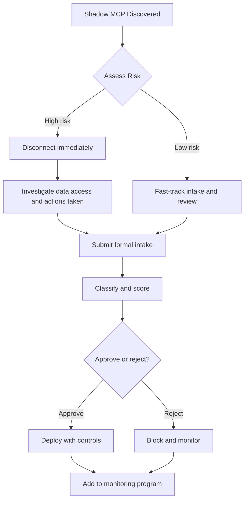

# Chapter 12: Shadow MCP Governance

**Audience:** CISOs, AppSec, security operations, and platform engineering  
**Decision supported:** Detecting, prohibiting, and remediating unapproved MCP servers  
**Reading time:** ~22 minutes

---

## Shadow MCP Is the Default Without Governance

Shadow MCP servers are integrations connected to enterprise AI systems **without** formal inventory, classification, or approval. They are MCP's version of shadow IT — often more dangerous because they grant AI agents direct access to tools and data at machine speed.

Shadow MCP proliferates because:

- Developers install community servers locally to improve productivity
- AI assistant configs are personal and not centrally managed
- MCP adds integrations with a few lines of JSON — minutes, not weeks
- Security review is perceived as slow; teams skip it
- Open-source servers look trustworthy based on GitHub stars
- No prohibition policy exists — or policy exists but is not enforced

[OWASP MCP09: Shadow MCP Deployments](https://owasp.org/www-project-mcp-top-10/) identifies this as a top risk. This chapter explains how to detect, prohibit, and remediate shadow MCP — and how to make the approved path faster than shadow installation.

---

## What Makes Shadow MCP Dangerous

| Risk | Real-world example |
|------|-------------------|
| Hardcoded secrets | API keys in `mcp.json` committed to dotfiles repo |
| Excessive permissions | Filesystem MCP with unrestricted read/write |
| Unsafe execution | Shell MCP running without sandbox on corporate laptop |
| No audit trail | Tool calls invisible to SecOps |
| Unknown data access | HR MCP connected without data owner knowledge |
| Supply chain risk | Unreviewed OSS with vulnerable dependencies |
| Tool chaining | Shadow read MCP + approved write MCP = exfiltration path |

---

## Detection Methods

Use multiple methods. No single approach finds everything ([Chapter 4](04-asset-inventory.md)).

### Automated discovery

| Method | What it finds | Cadence |
|--------|---------------|---------|
| Configuration file scanning | MCP entries in Cursor, Claude Desktop, VS Code configs | Weekly |
| Repository scanning | MCP in dotfiles, docker-compose, Helm, CI/CD | Weekly |
| Network monitoring | Outbound connections to MCP endpoints | Continuous |
| API gateway logs | MCP protocol traffic patterns | Continuous |
| Container image scanning | MCP binaries in deployed images | On build |
| Endpoint detection | Processes on MCP transport ports | Continuous |

### Manual discovery

| Method | What it finds |
|--------|---------------|
| Developer surveys | Servers scanners miss |
| Security attestations | Periodic "list all MCP you use" |
| Incident investigation | Shadow MCP during breach forensics |
| Audit findings | Compliance reviews |

### Platform enforcement (most effective)

- AI platforms enforce **MCP allowlists** — only inventoried, approved servers connect
- Configuration management blocks unapproved MCP entries on managed devices
- CI/CD scans PRs for MCP server references

**Prevention beats detection.** If the platform blocks unlisted servers, shadow MCP cannot connect through enterprise AI platforms — though unmanaged personal devices may still be a gap.

---

## Prohibition Policy

Publish clear policy. Sample language:

> **Shadow MCP Prohibition**
>
> Connecting unapproved MCP servers to enterprise AI systems, corporate devices, or networks accessing internal resources is prohibited.
>
> All MCP servers must be registered through the MCP intake process and receive formal approval before connection.
>
> Violations may result in removal of MCP access, disciplinary action per HR policy, and mandatory security review of affected systems.
>
> If you are using an MCP server not in the approved inventory, submit an [Intake Form](../templates/intake-form.md) immediately or disconnect the server.

Communicate policy through: developer onboarding, AI platform admin UI, security awareness training, and engineering all-hands.

---

## Remediation Path

When shadow MCP is discovered:

### Step 1: Assess immediate risk

| Question | Why it matters |
|----------|----------------|
| What data can it access? | Drives tier and urgency |
| What actions can it perform? | Write = disconnect first |
| How long connected? | Longer = more forensic work |
| Hardcoded credentials? | Rotate immediately |
| Still actively connected? | Live threat vs. historical |

**Priority matrix:**

| Profile | Action |
|---------|--------|
| Write + production data + secrets | Disconnect immediately; incident response |
| Write + internal data | Disconnect; fast-track intake |
| Read + sensitive data | Fast-track intake; enhanced monitoring |
| Read + public/non-sensitive | Fast-track intake; may stay connected during review |

### Step 2: Investigate

- Review available logs for tool calls and data access
- Identify users/agents that connected
- Check credential exposure in config files (rotate if found)
- Assess tool chaining with other MCP servers
- Document timeline for incident record if high-risk

### Step 3: Formal intake and review

- Submit [Intake Form](../templates/intake-form.md)
- Classify and score ([Chapters 5–6](05-server-classification.md))
- Third-party review if external ([Chapter 9](09-third-party-review.md))
- Approval decision ([Chapter 7](07-approval-workflow.md))

### Step 4: Remediate or block

| Outcome | Action |
|---------|--------|
| Approved | Deploy with full controls; add to risk register |
| Rejected | Block at platform; revoke credentials; notify users |
| Conditional | Apply conditions with deadline; monitor compliance |

### Step 5: Prevent recurrence

- Add detection rule for this server's signature
- Communicate policy to deploying team
- Update platform allowlists
- Track in monthly shadow MCP metrics ([Chapter 15](15-ciso-metrics.md))

---

## Exception Handling

If shadow MCP is business-critical and cannot disconnect immediately:

1. Document in [Exception / Risk Acceptance Form](../templates/exception-risk-acceptance-form.md)
2. Apply maximum compensating controls (logging, scope reduction, pilot users only)
3. Set mandatory remediation deadline — typically **30 days** to full approval or disconnect
4. CISO awareness required for Tier 3–4 shadow
5. Fast-track formal approval

**Exceptions are not permanent approvals.** They expire.

---

## Making the Approved Path Faster Than Shadow

Shadow MCP exists when friction to comply exceeds friction to ignore policy. Reduce compliance friction:

| Tactic | Implementation |
|--------|----------------|
| Fast Tier 0–1 approval | 5-day SLA; AppSec delegate authority |
| Self-service intake | Linked from AI platform and developer docs |
| Pre-approved server catalog | Curated list of vetted MCP for common needs |
| Templates and examples | "How to submit GitHub MCP intake" guide |
| Amnesty periods | Quarterly window to register shadow without penalty |
| Platform integration | Intake → auto-allowlist on approval |

---

## Metrics

Track monthly ([Chapter 15](15-ciso-metrics.md)):

| Metric | Target |
|--------|--------|
| Total MCP discovered | Increasing (better visibility) |
| Shadow MCP count | Trending toward **zero** |
| Shadow remediation rate | >90% within SLA |
| Repeat offenders (teams) | Decreasing; targeted training |

**Any non-zero shadow count requires active remediation** — not acceptance as "good enough."

---

## References

| Source | Relevance |
|--------|-----------|
| [Chapter 4 — Inventory & discovery](04-asset-inventory.md) | Detection methods |
| [OWASP MCP09](https://owasp.org/www-project-mcp-top-10/) | Risk category |
| [Chapter 14 — Incident Response](14-incident-response.md) | High-risk shadow handling |

---

## Practitioner Checklist

- [ ] Shadow MCP prohibition published in policy
- [ ] At least one automated detection method active
- [ ] Platform allowlists enforced where possible
- [ ] Remediation path documented and communicated
- [ ] Exception process defined with time limits
- [ ] Shadow MCP count tracked monthly
- [ ] Investigation procedure for high-risk discoveries
- [ ] Approved path SLAs faster than shadow incentive
- [ ] Post-remediation prevention measures applied

---

**Next:** [Chapter 13 — Continuous Monitoring](13-continuous-monitoring.md) defines ongoing logging, alerting, and periodic review requirements.
