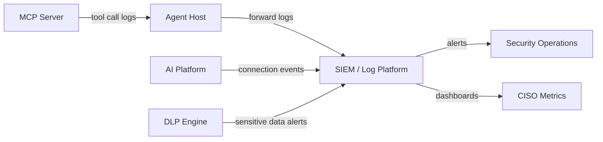

# Chapter 13: Continuous Monitoring

**Audience:** Security operations, AppSec, platform engineering, and MCP server owners  
**Decision supported:** Maintaining visibility into MCP usage and detecting anomalous or unauthorized behavior  
**Reading time:** ~24 minutes

---

## Approval Is the Beginning, Not the End

An approved MCP server can change the day after approval: new tools added, version upgraded, permissions expanded, credentials rotated poorly. Continuous monitoring ensures servers operate within approved scope, controls remain effective, and new risks surface before they become incidents.

This chapter covers **Stage 6 (Continuous Monitoring)** and **Stage 7 (Periodic Review)** of the [governance lifecycle](07-approval-workflow.md). It implements [Chapter 3 — Principle 5](03-governance-principles.md): auditability is non-negotiable.

Without monitoring, you cannot answer: *What did agents do yesterday through our approved MCP servers?*

---

## What to Monitor

### Tool call activity

| Signal | Why it matters | Example alert |
|--------|---------------|---------------|
| Tool call volume | Runaway agent or abuse | >3× baseline in 1 hour |
| Tool call types | New/unexpected tools invoked | `delete_repo` on read-only server |
| Failed tool calls | Auth failures, misconfig, attacks | >10 failures in 5 min |
| High-risk action frequency | Merge, delete, deploy, send | Spike in production deploys |
| Cross-server tool chains | Tool chaining exfiltration | Read CRM → send email in 30 sec |

### Authorization events

| Signal | Why it matters |
|--------|---------------|
| Failed authorization attempts | Credential abuse or scope violation |
| Token expiration/renewal | Stale credential management |
| Scope escalation attempts | Actions outside approved scope |
| HITL approval/denial rates | Blind approval or bypass attempts |

### Data access

| Signal | Why it matters |
|--------|---------------|
| Sensitive data access patterns | Unusual volume of confidential reads |
| DLP triggers | PII/secrets in tool parameters |
| Bulk read / export indicators | Large result sets; potential exfiltration |

### Configuration changes

| Signal | Why it matters |
|--------|---------------|
| New tools added to server | May change tier ([OWASP MCP05](https://owasp.org/www-project-mcp-top-10/)) |
| Version upgrades | New vulnerabilities or tools |
| Permission/OAuth scope changes | Privilege expansion |
| New MCP servers connected | Potential shadow MCP |

### Suspicious workflows

| Signal | Why it matters |
|--------|---------------|
| Prompt injection indicators | Encoded instructions in tool parameters |
| Off-hours high-risk actions | Deploy/delete at 3 a.m. |
| Rapid sequential writes | Automated abuse |
| Unexpected identities | Compromised credentials |

---

## Audit Log Requirements

Every MCP tool call at **Tier 2 and above** must produce a log entry with:

| Field | Required | Example |
|-------|----------|---------|
| Timestamp | Yes | `2026-06-29T14:32:01Z` |
| User identity | Yes | `jane.smith@company.com` |
| Agent/session ID | Yes | `agent-session-abc123` |
| MCP server name | Yes | `github-repo-management` |
| Tool name | Yes | `create_pull_request` |
| Parameters (sanitized) | Yes | `repo=payments-api`, `branch=feature-x` |
| Outcome | Yes | `success` / `denied` / `error` |
| Authorization result | Yes | `HITL-approved` / `denied` |
| Source IP / client | Recommended | `10.0.1.45` |
| Data classification touched | Tier 2+ | `confidential` |
| Duration | Recommended | `1.2s` |

### Sanitization rules

- **Never log:** secret values, tokens, passwords, full PII
- **Redact or hash:** email addresses, account numbers if not needed for investigation
- **Truncate:** large payloads; log hash or size instead

Logs must forward to SIEM or centralized logging. Retention must meet compliance requirements (often 1–7 years for regulated data).

---

## Alerting Rules

Configure alerts for high-priority events:

| Alert | Severity | Action |
|-------|----------|--------|
| Failed authorization spike (>10 in 5 min) | High | Investigate; potential attack |
| High-risk action without HITL approval | **Critical** | Block server; initiate IR ([Chapter 14](14-incident-response.md)) |
| New shadow MCP detected | High | Remediation per [Chapter 12](12-shadow-mcp-governance.md) |
| Sensitive data in tool parameters (DLP) | High | Block action; notify data owner |
| MCP server version change | Medium | Trigger re-classification review |
| New tool added to approved server | Medium | Trigger re-classification review |
| Off-hours Tier 4 tool call | High | Investigate immediately |
| Tool call volume >3× baseline | Medium | Review for runaway agent |
| Tool chaining pattern (read sensitive + write) | High | Investigate session configuration |

Tune thresholds per environment during first 4–8 weeks of baseline collection.

---

## Periodic Review Cadence

| Risk Tier | Frequency | Review scope |
|-----------|-----------|--------------|
| Tier 0 | Annually | Inventory accuracy, version currency |
| Tier 1 | Annually | Controls compliance, access appropriateness |
| Tier 2 | Every 6 months | Full control verification, data access, vendor status |
| Tier 3 | Quarterly | Threat model refresh, abuse re-testing, HITL effectiveness |
| Tier 4 | Monthly or continuous | Full audit, privileged access review, IR readiness |

### Periodic review checklist

- [ ] Inventory entry accurate and complete
- [ ] Risk tier still appropriate (re-classify if tools changed)
- [ ] Risk score updated if material changes
- [ ] All required controls verified ([Chapter 10](10-minimum-security-baseline.md))
- [ ] Audit logging functional — test tool call produces log
- [ ] No unresolved conditional approval items overdue
- [ ] Vendor/OSS status current (no new critical CVEs)
- [ ] Owner still valid and accountable
- [ ] Next review date scheduled
- [ ] Agent configurations reviewed for tool chaining

Document reviewer name and date in risk register.

---

## Monitoring Architecture

### Minimum viable monitoring (start here)

1. MCP servers log tool calls to structured stdout/JSON
2. Agent host or log shipper forwards to centralized platform
3. SIEM rules alert on critical events (HITL bypass, auth failures)
4. Monthly manual review of MCP metrics dashboard

### Mature monitoring (target state)

1. All of the above, plus:
2. AI platform enforces allowlists and logs connection events
3. DLP integrated into MCP tool call pipeline
4. Automated periodic review triggers based on tier cadence
5. Real-time CISO dashboard ([Chapter 15](15-ciso-metrics.md))
6. UEBA baselines for tool call volume and patterns

---

## Owner and AppSec Responsibilities

| Role | Monitoring duty |
|------|-----------------|
| MCP server owner | Report config changes; participate in periodic review |
| Engineering | Maintain logging infrastructure; fix broken log pipelines |
| AppSec | Define alert rules; conduct periodic reviews; tune thresholds |
| SecOps | Triage alerts; escalate incidents |
| CISO | Review monthly metrics; approve Tier 4 continuous monitoring gaps |

---

## References

| Source | Relevance |
|--------|-----------|
| [OWASP MCP03: Lack of Audit](https://owasp.org/www-project-mcp-top-10/) | Logging mandate |
| [Chapter 15 — Metrics](15-ciso-metrics.md) | Dashboard KPIs |
| [Chapter 14 — Incident Response](14-incident-response.md) | Alert escalation |

---

## Practitioner Checklist

- [ ] Audit logging enabled for all Tier 2+ MCP servers
- [ ] Log fields meet minimum requirements
- [ ] Logs forwarded to SIEM or centralized logging
- [ ] Sanitization rules prevent secrets in logs
- [ ] Alerting rules configured for high-priority events
- [ ] Periodic review cadence scheduled per tier
- [ ] Review checklist defined and assigned
- [ ] Configuration change detection active
- [ ] Monthly MCP metrics reviewed by security leadership

---

**Next:** [Chapter 14 — Incident Response Alignment](14-incident-response.md) defines what to do when an MCP server is compromised or misused.
