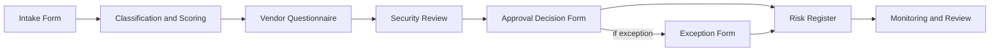

# Chapter 16: Templates

**Audience:** All practitioners — requesters, reviewers, approvers, and governance program managers  
**Decision supported:** Using standardized forms to drive consistent MCP governance decisions  
**Reading time:** ~18 minutes

---

## Why Templates Matter

Governance fails when every team invents its own request format, approval record, and vendor checklist. Inconsistent documentation means:

- AppSec cannot compare risk across servers
- Auditors cannot trace approval decisions
- Metrics cannot be automated ([Chapter 15](15-ciso-metrics.md))
- Incident responders cannot find server metadata quickly

This guide includes **five templates** that operationalize the [approval workflow](07-approval-workflow.md). They live in the [`templates/`](../templates/) directory — copy, adapt, and integrate into your GRC platform, ticket system, or wiki.

**Do not duplicate template field content in ad hoc emails or Slack threads.** Use the linked files so every decision is auditable.

---

## Template Index

| Template | File | When to use | Lifecycle stage |
|----------|------|-------------|-----------------|
| Intake Form | [intake-form.md](../templates/intake-form.md) | New MCP server request | Stage 1: Intake |
| Risk Register | [risk-register.md](../templates/risk-register.md) | Ongoing approved server inventory | All stages |
| Vendor Questionnaire | [vendor-questionnaire.md](../templates/vendor-questionnaire.md) | Third-party/OSS review | Stage 3: Security Review |
| Approval Decision Form | [approval-decision-form.md](../templates/approval-decision-form.md) | Document approval outcome | Stage 4: Approval |
| Exception / Risk Acceptance | [exception-risk-acceptance-form.md](../templates/exception-risk-acceptance-form.md) | Formal risk acceptance | Stage 4: Approval |

---

## How Templates Connect

Every approved server should have a traceable chain: **Intake → Review → Decision → Risk Register entry**.

---

## Template 1: Intake Form

### Who completes it

Requesting engineer or business owner — with business owner validating use case.

### When

**Before** any MCP server connects to enterprise AI systems. Retroactive intake is allowed for shadow MCP remediation ([Chapter 12](12-shadow-mcp-governance.md)) but not for avoiding review.

### Step-by-step

1. Requester downloads or opens [intake-form.md](../templates/intake-form.md)
2. Completes all required fields — especially **owner**, **tools**, **data accessed**
3. Business owner signs off on use case
4. Submits to AppSec / governance queue (ticket, email, portal)
5. AppSec acknowledges within 2 business days
6. If incomplete → returned; no review begins

### Key rules

- **No intake = no review = no approval**
- Incomplete forms returned without exception
- Owner must be a person, not a team alias

### What happens next

AppSec assigns tier ([Chapter 5](05-server-classification.md)), completes scoring ([Chapter 6](06-risk-scoring.md)), initiates security review.

---

## Template 2: Risk Register

### Who maintains it

AppSec or governance program manager.

### When

Updated upon:

- Approval or conditional approval
- Re-classification or re-scoring
- Periodic review completion
- Decommissioning
- Incident affecting server posture

### Purpose

Single source of truth for MCP governance status. [Chapter 15](15-ciso-metrics.md) monthly metrics are derived from this register.

### Key fields to keep current

| Field | Update trigger |
|-------|----------------|
| Approval status | Any decision change |
| Tier and risk score | Tool/scope change |
| Owner | Role change or departure |
| Next review date | After each periodic review |
| Open conditions | Conditional approval tracking |
| Version | Every deployment upgrade |

### Key rules

- One row per MCP server (or per logical server if read/write split)
- Decommissioned servers archived, not deleted
- Register reviewed monthly for accuracy

---

## Template 3: Vendor Questionnaire

### Who completes it

**Procurement** (vendor trust, contracts) + **AppSec** (security controls, testing).

### When

Required for all external/OSS MCP at Tier 2+. Recommended for Tier 0–1 OSS.

### Step-by-step

1. Requester provides vendor/repo information in intake
2. Procurement completes vendor trust section
3. AppSec completes security controls section
4. Legal/privacy completes data handling if sensitive data involved
5. AppSec performs hands-on testing (audience validation, logging)
6. Outcome recorded: Pass / Pass with conditions / Fail / Insufficient info

### Key rules

- Third-party MCP cannot be approved without completed questionnaire at Tier 2+
- See [Chapter 9](09-third-party-review.md) for review criteria
- Questionnaire filed with approval decision

---

## Template 4: Approval Decision Form

### Who completes it

Approval authority per tier ([Chapter 7](07-approval-workflow.md)):

| Tier | Approver |
|------|----------|
| 0–1 | Team lead or AppSec delegate |
| 2 | Security + data owner |
| 3 | Security arch + business + platform |
| 4 | CISO / risk board |

### When

After security review (Stage 3) is complete.

### Must document

- Decision: Approve / Conditional / Reject / Exception
- Approver name, role, date
- Tier and risk score (all eight factors)
- Required controls list
- Conditions + deadlines (if conditional)
- Next review date
- Residual risk acceptor (if exception)

### Key rules

- Every reviewed server gets a decision record — including rejections
- Conditional approvals list each condition with owner and deadline
- Decisions retained per audit retention policy (typically 3+ years)

---

## Template 5: Exception / Risk Acceptance Form

### Who completes it

Business risk owner + **CISO** (required Tier 3–4).

### When

Server cannot meet all minimum controls ([Chapter 10](10-minimum-security-baseline.md)) but business need is critical. Should be **rare**.

### Must document

- Residual risks explicitly listed
- Compensating controls in place
- Remediation plan with dates
- Expiration date for exception (typically ≤ 90 days)
- Named risk acceptors

### Key rules

- **Exceptions are not permanent approvals**
- Expired exceptions → suspend server until full approval or decommission
- Track active exceptions in monthly metrics (KPI 13)

---

## Adapting Templates to Your Organization

| Adaptation | Guidance |
|------------|----------|
| GRC platform (ServiceNow, Archer) | Map template fields to custom fields; automate workflow |
| Ticket system (Jira, Linear) | Intake form → ticket template; link to risk register |
| Spreadsheet | Risk register works well for small programs (<50 servers) |
| Confluence / wiki | Copy templates; add submission instructions and SLAs |
| API integration | Intake approval → auto-update AI platform allowlist |

### Fields you must not remove

Even when adapting format, preserve:

- Named owner
- Tool list with read/write classification
- Data classification
- Tier and risk score
- Approver and date
- Conditions and review dates

Removing fields weakens governance and auditability.

### Add fields when your environment needs them

Some organizations need additional fields because of their architecture or regulatory context. Common additions include:

| Field | Add when |
|-------|----------|
| Agent configuration ID | You approve combinations of agents and MCP servers, not only servers |
| Data residency | Data may cross country or regional boundaries |
| Tenant / workspace ID | SaaS platforms have multiple business tenants |
| Service account ID | Server uses non-human identity |
| SIEM index or log source | SecOps needs to find logs quickly |
| Change ticket ID | MCP server releases are controlled through ITSM |
| DLP policy ID | Sensitive data controls are enforced by named policies |
| Exception expiry date | Any required control is temporarily missing |

If a field helps answer "who did what, with which data, through which tool, and under whose approval," it probably belongs in the workflow.

---

## End-to-End Example: New Jira MCP

| Step | Template | Outcome |
|------|----------|---------|
| 1 | Intake Form | Engineering requests Jira MCP; owner: product manager |
| 2 | (Scoring in decision form) | Tier 3; score 24 |
| 3 | Vendor Questionnaire | Atlassian commercial — Pass |
| 4 | Approval Decision Form | Conditional: HITL required before ticket create |
| 5 | Risk Register | Entry added; status: conditional |
| 6 | (30 days later) | Condition verified; status → approved |
| 7 | Monthly metrics | Counted in approved total; Tier 3 distribution |

---

## Template Maintenance

Review templates **annually** or when:

- MCP authorization specification updates
- Organizational policy changes
- Audit findings identify missing fields
- New tier or control added to baseline

Template version and effective date should appear in each file footer.

---

## References

| Source | Relevance |
|--------|-----------|
| [Chapter 7 — Approval Workflow](07-approval-workflow.md) | Stage mapping |
| [Framework Mapping Appendix](../appendix/framework-mapping.md) | Compliance alignment |
| [All templates](../templates/) | Source files |

---

## Practitioner Checklist

- [ ] All five templates accessible to requesters and reviewers
- [ ] Submission process documented (portal, ticket, email)
- [ ] Intake required before any MCP connection
- [ ] Risk register established and maintained monthly
- [ ] Vendor questionnaire required for external MCP at Tier 2+
- [ ] Approval decisions documented for every reviewed server
- [ ] Exception process requires formal risk acceptance with expiration
- [ ] Templates reviewed annually for completeness
- [ ] GRC or ticket integration planned or implemented

---

**Related:** [Framework Mapping Appendix](../appendix/framework-mapping.md) maps this guide's controls to OWASP, NIST AI RMF, ISO 42001, and SOC 2 frameworks.
